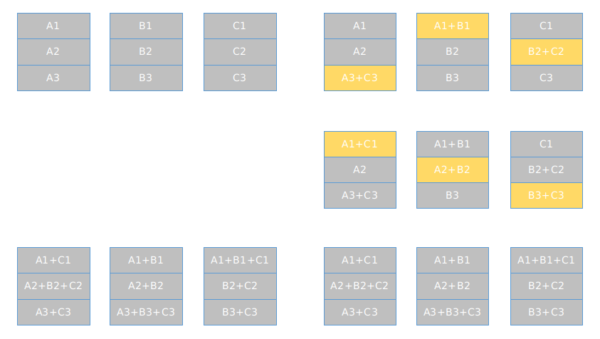

# horovod

## 概念
分布式集群训练工具，等价于MPI等

## 软件层级
1. 对接深度学习框架  
tensorflow、pytorch、Keras、MXNet
2. 相同层级
tensorflow分布式框架、MPI、
3. 向下
nccl

## 支持算子
broadcast、all-reduce、allgather

## 原理
1. ring-allreduce 环 


2. 梯度聚合原理

```
$ horovodrun -np 4 --fusion-threshold-mb 32 python train.py
```

## 操作步骤
1）初始化 horovod
```
hvd.init()
```
2）一个 GPU 与一个进程绑定
```
config = tf.ConfigProto()
config.gpu_options.visible_device_list = str(hvd.local_rank())
```
3）根据总 GPU 数量放大学习率
```
opt = tf.train.AdagradOptimizer(0.01 * hvd.size())
```
因为 BatchSize 会根据 GPU 数量放大，所以学习率也应该放大。

 4）使用 hvd.DistributedOptimizer 封装原有的 optimizer
 ```
opt = hvd.DistributedOptimizer(opt)
```
分布式训练涉及到梯度同步，每一个 GPU 的梯度计算仍然由原有的 optimizer 计算，只是梯度同步由 hvd.DistributedOptimizer 负责。

 5）广播初始变量值到所有进程
 ```
hooks = [hvd.BroadcastGlobalVariablesHook(0)]
```
主要为了确保所有进程变量初始值相同。

 6）只在 worker 0 上保存 checkpoint
 ```
checkpoint_dir = '/tmp/train_logs' if hvd.rank() == 0 else None
```
防止 checkpoint 保存错乱。
horovod 只是需要改动必要改动的，不涉及 Parameter Server 架构的 device 设置等繁琐的操作。

7）拉起训练

在单机 4 卡的机上起训练，只需执行以下命令：
```
horovodrun -np 4 -H localhost:4 python train.py
```
在 4 机，每机 4 卡的机子上起训练，只需在一个机子上执行以下命令即可：
```
horovodrun -np 16 -H server1:4,server2:4,server3:4,server4:4 python train.py
```
注意无论是单机多卡，还是多机多卡，都只需在一个机子上执行一次命令即可，其他机 horovod 会用 MPI 启动进程和传递数据。

## 链接
[horovod git hub原码链接](https://github.com/horovod/horovod)