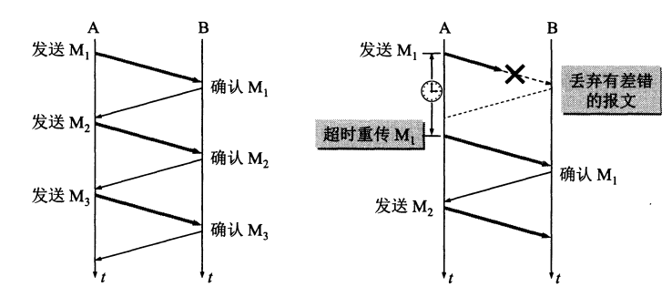
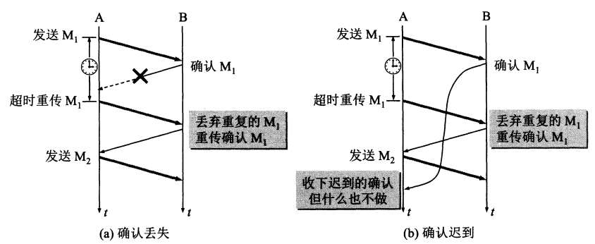

## UDP 特点
1. UDP是无连接的。
2. UDP是面向报文的。以上层传下来的报文，添加首部后直接下发交付层； 既不合并，也不拆分； 应用层传输下来多长的报文，就直接下发； UDP一次交付完整的报文； 
3. UDP没有拥塞控制； 
4. UDP支持一对一，一对多，多对一，多对多； 
5. UDP的首部开销小，只有8字节； 

##　TCP 
### TCP 特点
1. TCP 面向连接；
2. TCP 是面向字节流；　
3. TCP 提供可靠交付服务，保证传输的数据无差错，不丢失，不重复；　
4. TCP 只能是一对一；　

### TCP 可靠传输的工作原理ARQ(自动重传)

1. 无差错。每发送１个，就暂停，等待接收确认；　
2. 出差错，发送的M1未接收到，超时后重传；　
3. 出差错，M1接收到，A的确认未收到，A重传，B可能会收到重复的M1,丢弃重复的； 
4. 出差错，确认迟到，收到确认，啥也不做；

### TCP 可靠传输的实现--滑动窗口

如图示，A以一定窗口大小发送数据； B以一定窗口大小接收数据； B分别对窗口内的数据逐一确认； 已收到的数据，给A回复确认消息； A若收到确认消息，指针可以继续往前移动； 
### TCP 流量控制

### TCP 拥塞控制

### TCP 连接管理
1. 三次握手
2. 四次释放
3. 状态跳转

