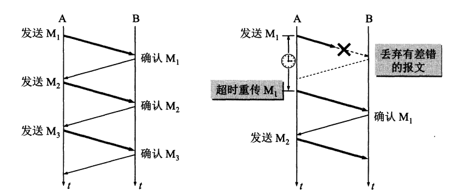
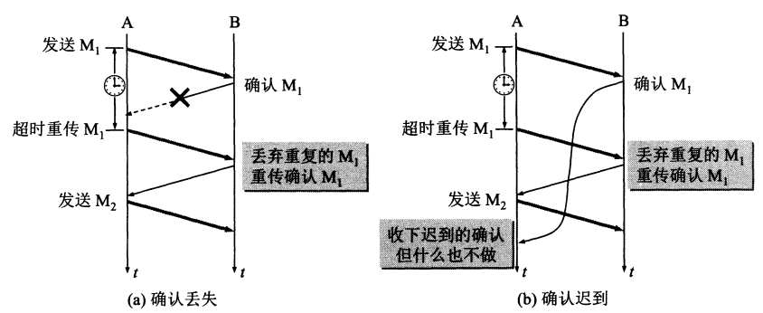
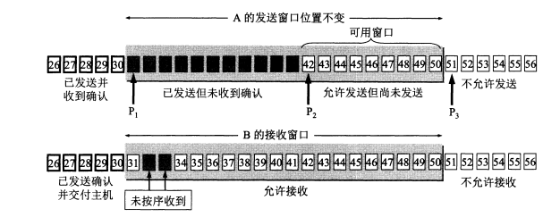
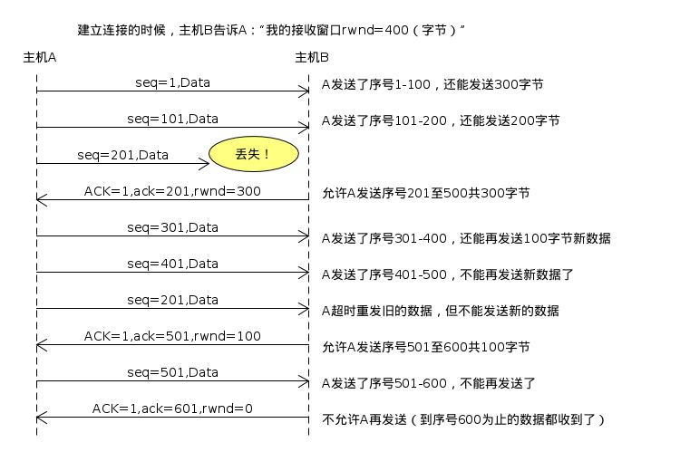
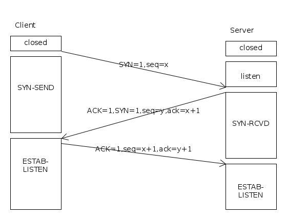
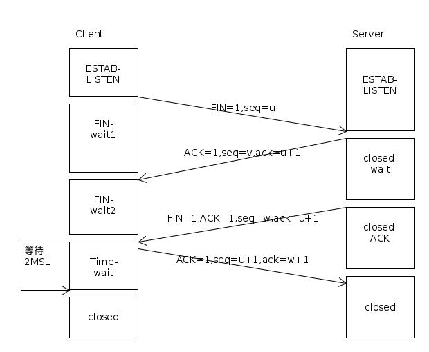

## UDP 特点
1. UDP是无连接的。
2. UDP是面向报文的。以上层传下来的报文，添加首部后直接下发交付层； 既不合并，也不拆分； 应用层传输下来多长的报文，就直接下发； UDP一次交付完整的报文； 
3. UDP没有拥塞控制； 
4. UDP支持一对一，一对多，多对一，多对多； 
5. UDP的首部开销小，只有8字节； 

## TCP 
### TCP 特点
1. TCP 面向连接；
2. TCP 是面向字节流；　
3. TCP 提供可靠交付服务，保证传输的数据无差错，不丢失，不重复；　
4. TCP 只能是一对一；　

### TCP 可靠传输的工作原理ARQ(自动重传)

1. 无差错。每发送１个，就暂停，等待接收确认；　
2. 出差错，发送的M1未接收到，超时后重传；　
3. 出差错，M1接收到，A的确认未收到，A重传，B可能会收到重复的M1,丢弃重复的； 
4. 出差错，确认迟到，收到确认，啥也不做；

### TCP 可靠传输的实现--滑动窗口

如图示，A以一定窗口大小发送数据； B以一定窗口大小接收数据； B分别对窗口内的数据逐一确认； 已收到的数据，给A回复确认消息； A若收到确认消息，指针可以继续往前移动； A达到超时

### TCP 流量控制

利用滑窗机制实现流量控制。

**发送窗口不能比接收窗口大，因此可以通过接收端来实现流量控制**。
假设在建链时，B告诉A其可接收的窗口大小（400），A根据自已的窗口不断给B发送数据；若B的缓存减小，则返回给A新的可接收窗口大小； 若B的缓存减小为0，则，rwnd减小为0，A停止发送。

### TCP 拥塞控制
拥塞：对资源的需求 > 可用资原

1. 慢开始
慢开始：通过探测的方法，由小到大增大发送的窗口； 当报文出现被丢弃时，则可以认为出现了拥塞；若没有出现丢弃，则将**发送窗口翻倍**；  
2. 拥塞避免
与慢开始不同的时，不是每经过一个往返时间发送翻倍翻倍，只是将发送窗口+1，应此发送窗口增大更加缓和；
3. 快重传
快重传的目的是为了让发送方尽快知道个别报文丢失，因此要求接收方尽快发送确认； 即使收到了失序的报文段，也发送确认； 每次失序，都发送一个确认； 如果发送方连续收到3个相同的重传确认，就减小发送窗口，同时启动重传； 
4. 快恢复
快恢复时是指发现丢失个别的报文段时，调整发送的门限值为原来的1/2

### TCP 连接管理
1. 三次握手

client的第三次握手，目的是防止已失效的建链请求报文，导致重复建链；
假设client已发送的了一个建鏈请求，但是被滞留在网络中一段时间； client就会重新发送请求；这样会造成两次建链。因此client的ack作为建链的真正请求； 只有收到client的ack ，server才会建链； 

2. 四次挥手

2MSL 的tim_wait作用主要是为了防止最后一个ack没有收到，还得重复发送； 
一般是4分钟； 

四次挥手的原因：TCP是全双工通信，也支撑半双工。其中一端发起closed的动作，只是告诉对端自已要发送的内容已经全部发送完成了，但是仍然可以接收信息； 另一端仍然可以发送信息；因此需要两侧分别发送一个close消息； 

3. 状态跳转
closed: 关闭状态
listen: 作为server才有的状态位，监听状态
sys_send: 同步发送，client 调用connect阶段
syn_rcvd: 同步接收状，server发送同步确认信息
estab_listern:连接建拉，可以发送信息
fin_wait1:发送第一个close消息
close_wait:回复第一个close ack消息
fin_wait2: 收到一个close ack消首，等待收到第二个close消息
close_ack: 发送第二个close 消息，等待ack
time_wait:收到第二个close消息，发送了第二个ack,等待2msl

