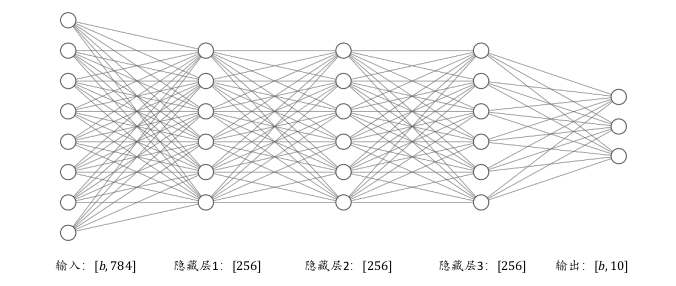
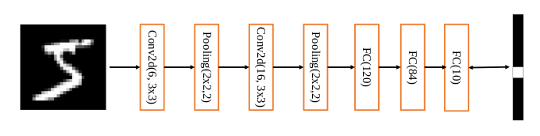
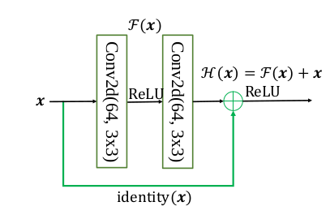
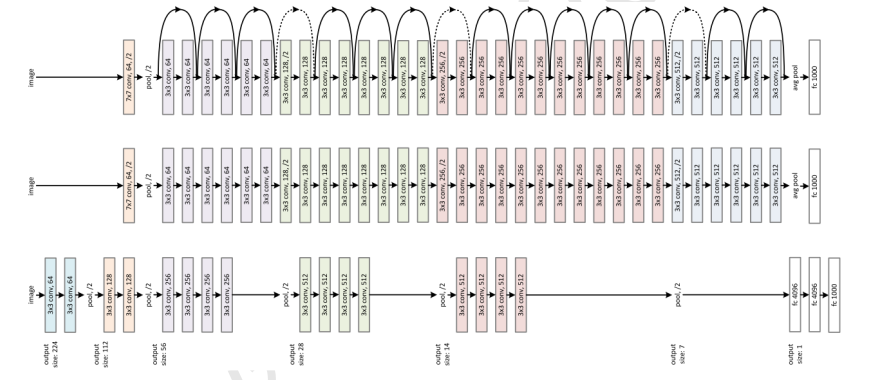

# TENSORFLOW

1. 基本内容
2. 基本运算
3. NN神经网络
4. LeNet卷积神经网络
5. Resnet 卷积神经网络
6. 其他

## 一、基本内容
**tensorflow (张量流)， google提供的一系列算子，例如：矩阵运算，梯度求导，图像预处理（旋转、剪切）等等，便于开发者进行AI相关的算法开发；同时也提供了一系列其他功能：计算图、checkpoint持久化、分布式**
### 1.1 基本数据类型
数值类型的张量是 TensorFlow 的主要数据载体,根据维度数来区分,可分为:
+ **标量(Scalar)**：**单个**的实数,如 1.2, 3.4 等,**维度(Dimension)数为 0**,shape 为[]。
+ **向量(Vector)**：**n个实数的有序集合**,通过中括号包裹,如[1.2],[1.2, 3.4]等,**维度数为 1**,长度不定,shape 为[n]。
+ **矩阵(Matrix)**： n行m列实数的有序集合,如[[1,2], [3,4]],**也可以写成维度数为 2*,每个维度上的长度不定,shape 为[n, m]。
+ **张量(Tensor)**： **所有维度数dim > 2的数组统称为张量**。  
    张量的每个维度也作轴(Axis),一般维度代表了具体的物理含义,比如 Shape 为[2,32,32,3]的张量共有 4 维,如果表示图片数据的话,每个维度/轴代表的含义分别是图片数量、图片高度、图片宽度、图片通道数,其中 2 代表了 2 张图片,32 代表了高、宽均为 32,3 代表了 RGB 共 3 个通道。张量的维度数以及每个维度所代表的具体物理含义需要由用户自行定义。

在 TensorFlow 中间,为了表达方便,**一般把标量、向量、矩阵也统称为张量**,不作区分,需要根据张量的维度数或形状自行判断,本书也沿用此方式。

### 1.2 Tensorflow 2.0 与 1.0的关键区别
#### 1.1.1 TensorFlow 2支持动态图
TensorFlow 2 是一个与 TensorFlow 1.x 使用体验完全不同的框加TensorFlow 2 不兼容TensorFlow 1.x 的代码。  
**TensorFlow 2 支持动态图优先模式,在计算时可以同时获得计算图与数值结果,可以代码中调试并实时打印数据。**
#### 1.1.2 引入keras高层API
见后续详细说明

## 二. 基本运算
* 四则运算（+-×/)  
* 反向求导  
* 链式法则  
* 卷积  
* 其他常用的算子

## 三. NN神经网络



## 四. LeNet-5 卷积神经网络



## 五. Resnet 卷积神经网络

研究人员发现网络的层数越深,越有可能获得更好的泛化能力。但是当模型加深以
后,网络变得越来越难训练,这主要是由于梯度弥散和梯度爆炸现象造成的。在较深层数的神经网络中,梯度信息由网络的末层逐层传向网络的首层时,传递的过程中会出现梯度接近于 0 或梯度值非常大的现象。网络层数越深,这种现象可能会越严重

一个很自然的想法是,既然浅层神经网络不容易出现这些梯度现象,那么可以尝试给深层神经网络添加一种回退到浅层神经网络的机制。

ResNet 通过在卷积层的输入和输出之间添加 Skip Connection 实现层数回退机制,如下图所示,输入x通过两个卷积层,得到特征变换后的输出F(x),与输入x进行对应元素的相加运算,得到最终输出H(x):  
```
H(x) = x + F(x)
```

  
残差块



## 六. 其他
[tensorflow 2.0官网网站](https://tensorflow.google.cn/swift/api_docs?hl=en)  
[tensorflow 2.0中文网站](http://www.tensorfly.cn/)  
[tensorflow 2.0深度学习](https://github.com/horovod/horovod)  


